# Postal details Rest API Design Document
## Problem Statement 
Create a **REST API** which will accept **customer Id** as **query parameter**. 
Use that **customer Id** to fetch the data from **Customer Database** in order to get **PIN** code for that customer. Use this **PIN** code to get postal address details from India Post **Rest API**. 
Transform the response in the desired format to generate final response

## Postal details Rest API:
`Description:`

It is an API which is used to get customer data from DB and use that data to get postal details from India Post API. We have the customer database and it has following no of columns in remote DB as shown below
Customer’s table column name
> Id:
>> Integer

> first_name:
>> varchar

> last_name:
>> varchar

> address:
>> varchar

> pin:
>> Integer

> email:
>> varchar

> login:
>> varchar

> identifier:
>> varchar

`End-Points:` 
[GET-returns specific record](http://run.quickintegrate.io/dev/restapi/getPostalInfo?ID=4)

#### SETP 1:
Login to Quick Integration Platform to get started.

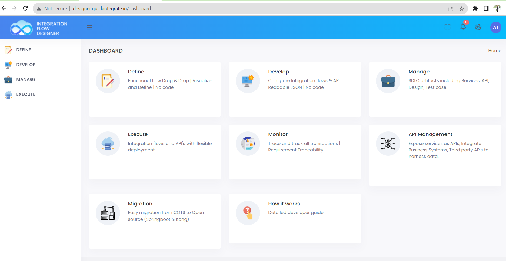

#### STEP 2:
Click on **Manage** Option >> **Projects** >> **Create** to create the new project

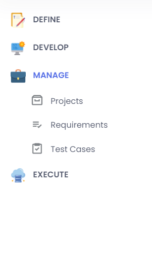
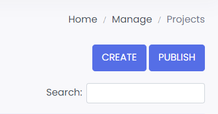

`Once project is created, below popup shows up.`

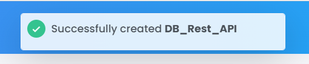

#### STEP 3:
Go to **DEVELOP** >> **Functionality** API

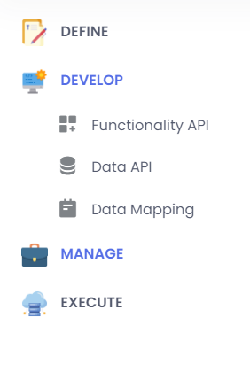

Select relevant project and create services in that project
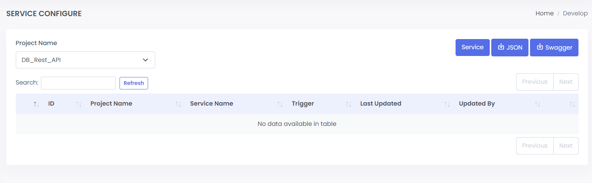
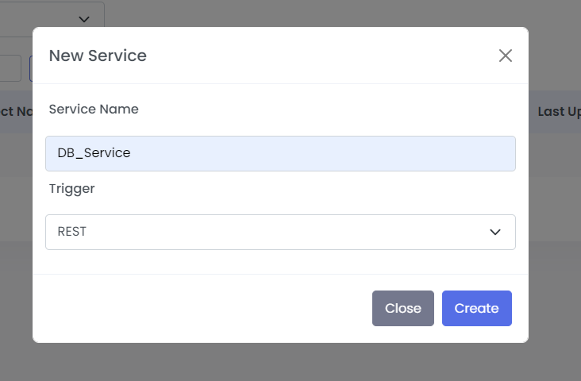

Once service name is provided, canvas will show up:

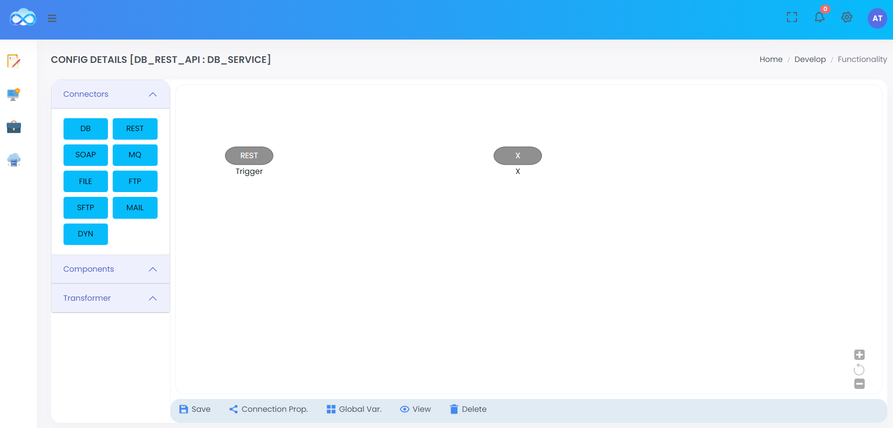

Drag utility component to add start and end logger for you service.

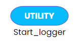

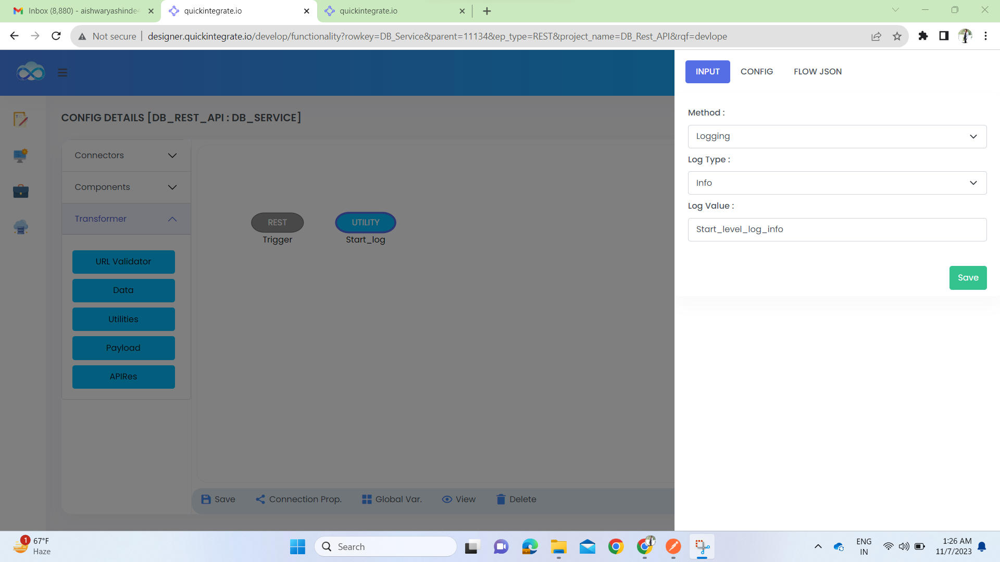

Drag URIVALIDATOR to validate the URL.

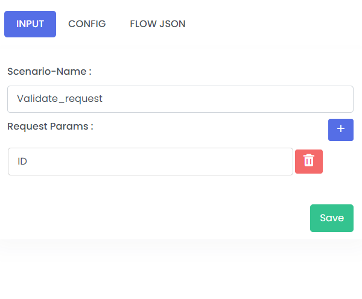

Drag DB connector to make DB call in the service.

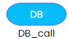

Add DB connectivity details in configuration:

Select the database configuration created to configure DB component:

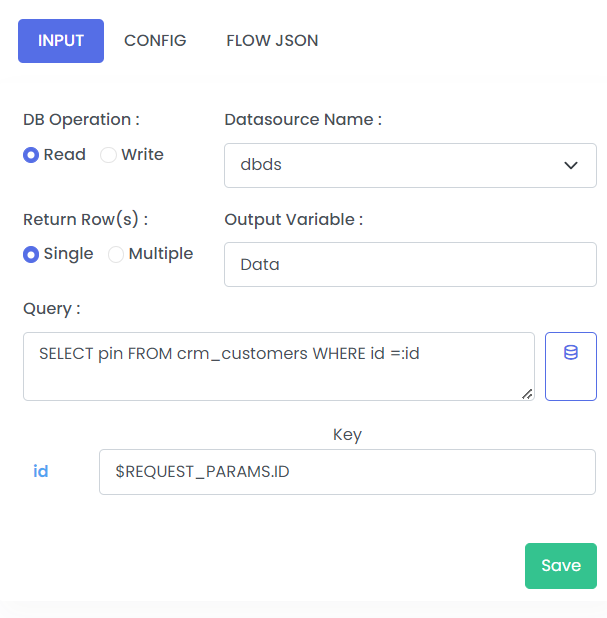

Define Global variables to be used in the service:

Drag REST component to make India Post REST API call to get postal details based on PIN code.

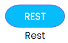

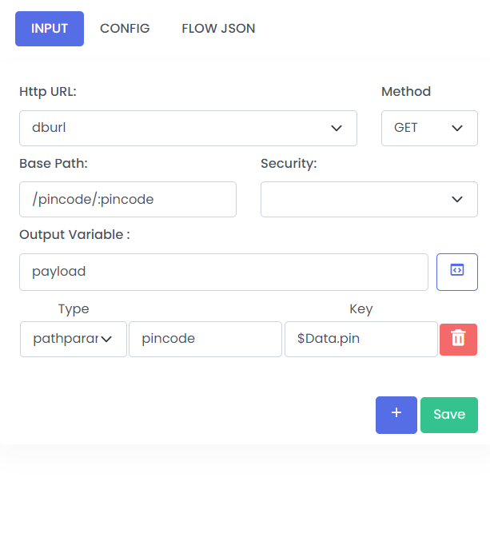

                              
